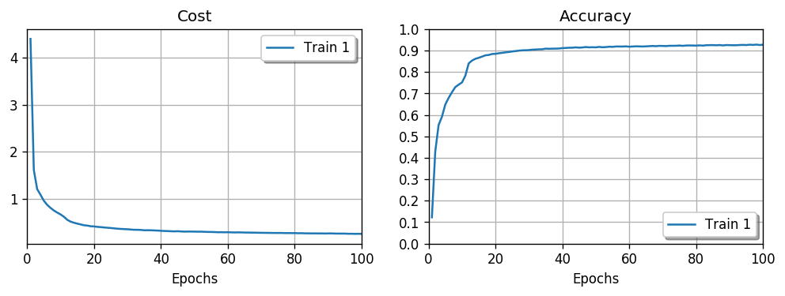
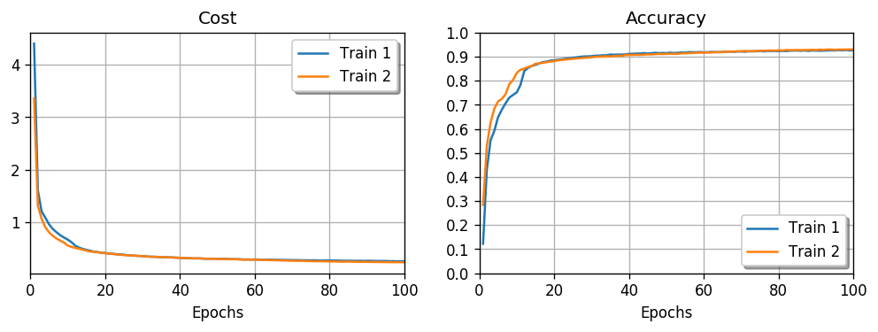

# DeepEasy: birth for research and fun


DeepEasy，一个基于 Numpy 的深度娱乐框架。

「这里的神经元似乎充斥着一股神秘力量。」

## Getting started

### Basic

定义神经网络结构：

```python
nn_architecture: List[Dict] = [
    {   # 第一层
        'input_dim': int,  # 该层每个神经元被连接数
        'output_dim': int, # 该层神经元数
        'activation': str, # 该层激活函数，可选
    },
    {   # 第二层
        ...
    }
    ...
]
```

实例化对象，指定随机数种子 seed，保证每次随机初始化 weight 的值都相同，便于测试：

```python
from deepeasy.nnet import NeuralNetwork

nn_architecture = [
    {'input_dim': 28 * 28, 'output_dim': 16, 'activation': 'relu'},
    {'input_dim': 16, 'output_dim': 16, 'activation': 'relu'},
    {'input_dim': 16, 'output_dim': 10, 'activation': 'softmax'},
]

nn = NeuralNetwork(nn_architecture, seed=100)
```

载入 Mnist 数据集：

```python
from deepeasy.datasets import load_mnist

# 需要提前下好，放入同一个文件夹
# 下载地址：http://yann.lecun.com/exdb/mnist/
# 一共 4 个 *.gz 文件
# 分别代表训练数据、训练数据标签、测试数据、测试数据标签
file_path = '/home/zzzzer/Documents/data/数据集/mnist/'
x_train, y_train, x_test, y_test = load_mnist(file_path)
# x_train.shape=(60000, 784), y_train.shape=(60000, 10)
# x_test.shape=(10000, 784), y_test.shape=(10000, 10)
```

查看某一张图片，及其标签：

```python
from PIL import Image

img_idx = 10
# 查看图片
Image.fromarray(x_test[img_idx].reshape(28, 28))
# 查看对应标签
y_test[img_idx]
```


开始训练：

```python
nn.train(
    x_train, y_train, 50,
    batch_size=600,
    lr=0.001,
    optimizer_name='adam'
)
```

画出 Cost、Accuracy 走势：

```python
nn.plot_history()
```


测试模型：

```python
nn.test_model(x_test, y_test)
```

### Advance

继续执行 `nn.train()` 方法，在现有模型上继续训练：

```python
nn.train(
    x_train, y_train, 50,
    batch_size=600,
    lr=0.001,
    optimizer_name='adam'
)

nn.plot_history()
```

可以看到，迭代次数从 50 到了 100：



`new_train=True` 清除前面模型的参数，重新开始训练，但前面模型的 Cost 和 Accuracy 历史会被保留：

```python
nn.train(
    x_train, y_train, 100,
    new_train=True,
    batch_size=600, 
    lr=0.001,
    optimizer_name='rmsprop'
)

nn.plot_history()
```



`nn.reset_params(keep_history=False)` 清空所有训练记录，回到初始状态，但保留神经网络结构。

其他用法见 `nn.train()` 的参数。

## Installation

```python
python3 setup.py install
```

## Supported algorithms

- Xavier Initializer
- Mini Batch
- Forward Propagation
- Backward Propagation
- SGD
- Momentum
- RMSprop
- Adam
- Nadam
- Inverted Dropout
- Cross Entropy Cost
- Mean Squared Cost

## Todo list

- Batch Normalization
- Regularization
- Tests

## References

吴恩达. [深度学习工程师](https://mooc.study.163.com/smartSpec/detail/1001319001.htm). 网易云.

SkalskiP. [ILearnDeepLearning.py](https://github.com/SkalskiP/ILearnDeepLearning.py). GitHub.

斋藤康毅.《深度学习入门：基于Python的理论与实现》. 人民邮电出版社.

keras-team. [keras](https://github.com/keras-team/keras). GitHub.
